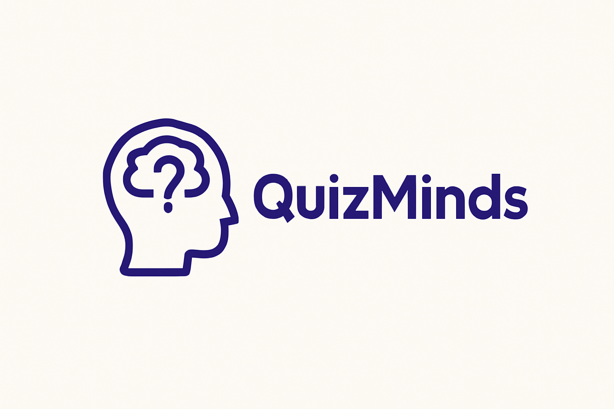

# 🧠 Quiz Minds

<div align="center">
  
  
  **A Modern Flutter Quiz Application with Advanced Features**
  
  [](https://flutter.dev/)
  [](https://dart.dev/)
  [](https://firebase.google.com/)
  [](LICENSE)
</div>

---

## 📖 About

Quiz Minds is a feature-rich Flutter quiz application that offers an engaging learning experience across multiple categories. Built with modern Flutter architecture and Firebase integration, it provides seamless user authentication, real-time leaderboards, and an intuitive quiz interface.

## ✨ Features

### 🔐 **Authentication & User Management**
- **Firebase Authentication** with email/password
- **Google Sign-In** integration
- **Guest Mode** for quick access
- **Profile Management** with photo updates
- **Password Reset** functionality
- **Account Deletion** option

### 🎯 **Quiz System**
- **Multiple Categories**: Flutter, Programming, Geography, General Knowledge
- **10 Questions** per quiz session
- **Scoring System**: 10 points per correct answer
- **Progress Tracking** with visual indicators
- **Results Summary** with detailed feedback
- **Timer-based** questions (optional)

### 🏆 **Leaderboard & Competition**
- **Global Leaderboard** with top performers
- **Real-time Score Updates** via Firestore
- **User Rankings** and achievements
- **Performance Statistics**

### 🎨 **UI/UX Excellence**
- **Lottie Animations** for enhanced user experience
- **Custom Navigation** with Go Router
- **Responsive Design** for all screen sizes
- **Dark/Light Theme** support
- **Smooth Transitions** and micro-interactions

### 🔒 **Privacy & Security**
- **Privacy Policy** implementation
- **Secure Data Handling** with Firebase
- **Local Storage** with SharedPreferences
- **GDPR Compliant** user data management

## 🏗️ Technical Architecture

### **Design Pattern**
- **BLoC (Business Logic Component)** for state management
- **Clean Architecture** with separation of concerns
- **Feature-based** modular structure
- **Dependency Injection** with GetIt

### **Tech Stack**
```
Frontend: Flutter 3.0+ / Dart 3.0+
Backend: Firebase (Auth, Firestore, Core)
State Management: Flutter BLoC
Navigation: Go Router
Local Storage: SharedPreferences
Animations: Lottie
Authentication: Firebase Auth + Google Sign-In
```

## 📱 App Flow

```
┌─────────────────┐    ┌─────────────────┐    ┌─────────────────┐
│   Splash Screen │ →  │  Authentication │ →  │   Home Screen   │
└─────────────────┘    └─────────────────┘    └─────────────────┘
                              │                        │
                         ┌────▼────┐                   │
                         │  Guest  │                   │
                         │  Mode   │                   │
                         └─────────┘                   │
                                                       │
┌─────────────────┐    ┌─────────────────┐    ┌───────▼─────────┐
│     Results     │ ←  │  Quiz Playing   │ ←  │ Category Select │
└─────────────────┘    └─────────────────┘    └─────────────────┘
         │                                              │
         ▼                                              │
┌─────────────────┐    ┌─────────────────┐    ┌───────▼─────────┐
│   Leaderboard   │    │    Profile      │    │   More Options  │
└─────────────────┘    └─────────────────┘    └─────────────────┘
```

## 🚀 Getting Started

### **Prerequisites**
```bash
Flutter SDK: >=3.0.0
Dart SDK: >=3.0.0
Android Studio / VS Code
Firebase Project Setup
```

### **Installation**

1. **Clone the repository**
```bash
git clone https://github.com/yourusername/quiz_minds.git
cd quiz_minds
```

2. **Install dependencies**
```bash
flutter pub get
```

3. **Firebase Setup**
```bash
# Add your google-services.json (Android)
# Add your GoogleService-Info.plist (iOS)
# Configure Firebase project with Authentication and Firestore
```

4. **Run the application**
```bash
flutter run
```

## 📦 Dependencies

### **Core Dependencies**
```yaml
flutter_bloc: ^8.1.3          # State management
go_router: ^10.1.2            # Navigation
firebase_core: ^2.15.1        # Firebase core
firebase_auth: ^4.7.3         # Authentication
cloud_firestore: ^4.8.5       # Database
google_sign_in: ^6.1.4        # Google Auth
shared_preferences: ^2.2.0    # Local storage
lottie: ^2.6.0                # Animations
```

### **Development Dependencies**
```yaml
flutter_test: ^1.0.0          # Testing framework
flutter_lints: ^2.0.0         # Code analysis
build_runner: ^2.4.6          # Code generation
```

## 📁 Project Structure

```
lib/
├── 📁 core/
│   ├── 📁 constants/          # App constants and themes
│   ├── 📁 di/                 # Dependency injection
│   ├── 📁 services/           # Core services
│   └── 📁 utils/              # Utility functions
├── 📁 features/
│   ├── 📁 auth/               # Authentication module
│   │   ├── 📁 data/           # Data layer
│   │   ├── 📁 domain/         # Business logic
│   │   └── 📁 presentation/   # UI components
│   ├── 📁 quiz/               # Quiz functionality
│   ├── 📁 leaderboard/        # Leaderboard system
│   ├── 📁 profile/            # User profile
│   └── 📁 home/               # Home screen
├── 📁 shared/
│   ├── 📁 widgets/            # Reusable widgets
│   └── 📁 models/             # Data models
└── main.dart                  # App entry point
```

## 🎯 Key Features Implementation

### **Authentication Flow**
- Email/Password registration and login
- Google Sign-In integration
- Guest mode for immediate access
- Persistent login state management

### **Quiz Engine**
- Dynamic question loading from Firestore
- Real-time score calculation
- Category-based question filtering
- Progress tracking and results

### **State Management**
- BLoC pattern implementation
- Event-driven architecture
- Reactive UI updates
- Error handling and loading states

## 📊 Performance Metrics

- **App Size**: ~25MB (optimized)
- **Cold Start**: <3 seconds
- **Quiz Loading**: <1 second
- **Score Sync**: Real-time
- **Memory Usage**: Optimized for low-end devices

## 🔮 Future Enhancements

- [ ] **Offline Mode** with local question caching
- [ ] **Custom Quiz Creation** by users
- [ ] **Social Features** - Friend challenges
- [ ] **Advanced Analytics** - Performance insights
- [ ] **Multi-language Support**
- [ ] **Voice Questions** and audio support
- [ ] **Timed Challenges** and tournaments
- [ ] **Achievement System** with badges

## 🤝 Contributing

We welcome contributions! Please see our [Contributing Guidelines](CONTRIBUTING.md) for details.

1. Fork the repository
2. Create your feature branch (`git checkout -b feature/AmazingFeature`)
3. Commit your changes (`git commit -m 'Add some AmazingFeature'`)
4. Push to the branch (`git push origin feature/AmazingFeature`)
5. Open a Pull Request

## 📄 License

This project is licensed under the MIT License - see the [LICENSE](LICENSE) file for details.

## 👨‍💻 Developer

**Hossam Ahmed**
- 📧 Email: your.email@example.com
- 🔗 LinkedIn: [Your LinkedIn Profile](https://linkedin.com/in/yourprofile)
- 🐙 GitHub: [@yourusername](https://github.com/yourusername)

---

<div align="center">
  <strong>Built with ❤️ using Flutter</strong>
  
  ⭐ Star this repo if you found it helpful!
</div>